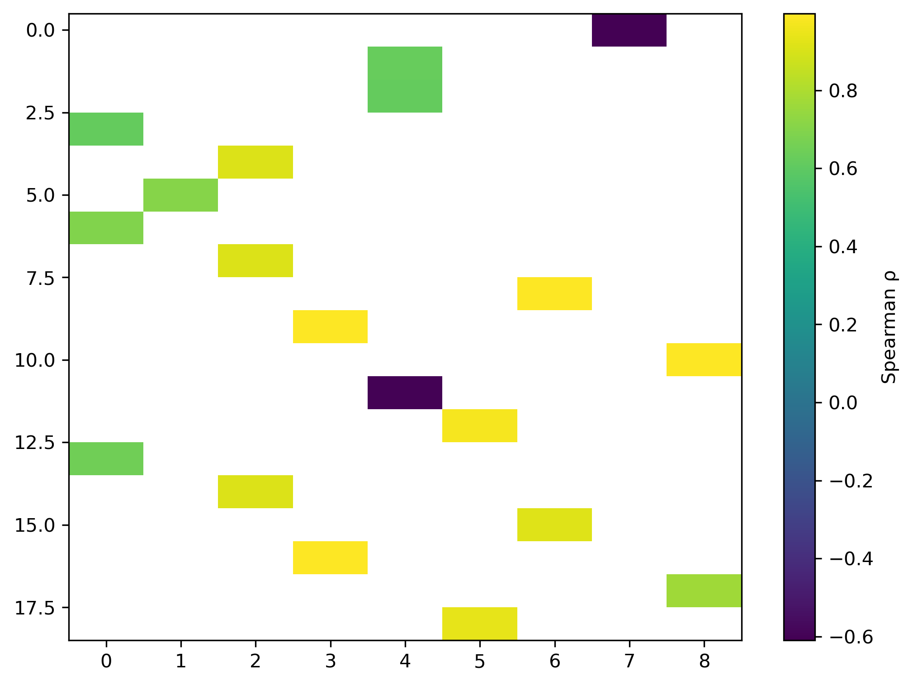

# Identifying Process Variables Associated with Manufacturing Failures (SECOM)

## Overview 
This project analyzes the SECOM semiconductor manufacturing dataset to identify process variables associated with manufacturing failures. The dataset is high-dimensional and strongly imbalanced, reflecting common challenges in real industrial process monitoring settings.

Rather than aiming to build a highly optimized predictive model, the focus is on interpretable modeling that can inform process investigation. Lasso-regularized logistic regression is used as a baseline method to identify variables associated with failure, with the goal of providing process engineers a principled starting point for examining potentially problematic measurements. Because lasso retains only one representative from groups of correlated variables, pairwise association analysis is used to recover additional structure suppressed by regularization.

Overall, the objective is to understand which process measurements are informative while explicitly accounting for the limitations of sparse models in high-dimensional settings.

## Data 
- Source: SECOM Semiconductor Manufacturing Dataset
- Observations: 1,567 production runs, of which 104 correspond to failures
- Attributes: 590 continuous variables
- Outcome: binary pass/ fail label

## Methods
### Data Cleaning and Preparation
- Verified alignment between raw feature and label files
- Removed duplicate variables to eliminate redundant measurements
- Examined missingness patterns across features
- Split the data into training (60%), validation (20%), and test (20%) sets using stratification to preserve the pass/fail distribution
- Removed non-informative variables, including:
  - Constant or near-constant features
  - Variables measured exclusively or almost exclusively in one outcome class
  - Features missing in ≥ 60% of observations
- Performed mean imputation using statistics computed only on the training set, and applied these values to all splits to avoid data leakage
- Standardized all features
- Conducted exploratory PCA to inspect variance structure (used for inspection only, not modeling)

### Model Training and Validation
- Trained lasso-regularized logistic regression models across a range of regularization strengths
- Evaluated models on the validation set using precision–recall curves, which are more appropriate than accuracy given the severe class imbalance
- Compared validation performance across regularization values and selected C = 0.0003
- Fit a final model using the combined training and validation data
- Evaluated the final model once on the held-out test set

### Pairwise Association Analysis
Because lasso regularization retains only one representative from groups of correlated variables, additional association analysis was performed to recover these variables.
- Refit the final lasso model to recover the selected feature set
- Computed pairwise Spearman rank correlations between model-selected features and non-model-selected features
- Retained only strong monotonic associations (|ρ| ≥ 0.6) to maintain interpretability
- Visualized associations using a filtered heatmap
- Summarized results in a grouped table listing, for each selected feature, strongly associated non-selected variables

All association analyses were restricted to the training and validation data; the test set was not used.

## Results
### Lasso-Selected Process Variables
The final lasso-regularized logistic regression model (C = 0.0003) selects 29 process variables associated with manufacturing failures. These variables represent a sparse subset of the full feature space and serve as a prioritized set of measurements for further investigation.

A table listing the selected variables and their corresponding coefficients is provided here.
[View table: Lasso-selected process variables](results/tables/lasso_selected_features_C_0p0003.csv)

### Recovery of Correlated Process Variables
Because lasso retains only one representative from groups of correlated variables, additional association analysis was performed to identify non-selected features strongly associated with the selected set.

Pairwise Spearman rank correlations (|ρ| ≥ 0.6) between selected and non-selected variables reveal clusters of related measurements that may reflect shared underlying process behavior.

A filtered heatmap visualizing these strong associations is shown below, and a grouped table summarizes the additional variables associated with each selected feature.

[View table: Lasso-selected features plus strongly associated variables](results/tables/lasso_selected_plus_strong_spearman_grouped_rho_ge_0p6.csv)

## Requirements
- Python 3.10+
- pandas >= 2.0
- matplotlib >= 3.9
- numpy
- scikit-learn
- seaborn

## Repository Structure
data/
  cleaned/    – frozen train/validation/test splits
  raw/        – original SECOM data files

notebooks/
  01_clean_and_explore.ipynb
  02_model_training_and_validation.ipynb
  03_pairwise_association.ipynb

results/
  figures/    – plots and visual summaries
  tables/     – machine-readable result tables

README.md
LICENSE

## License
MIT
